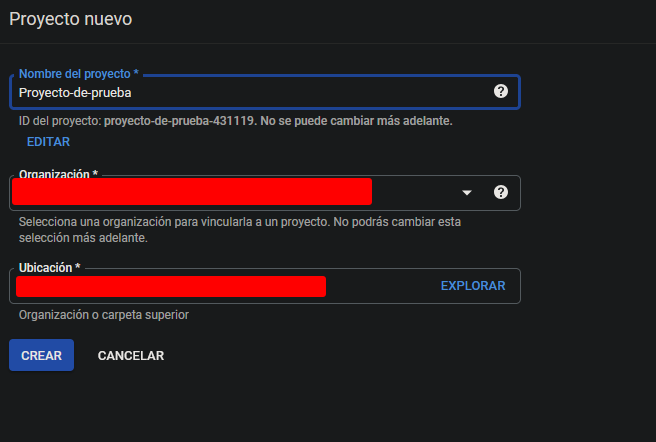
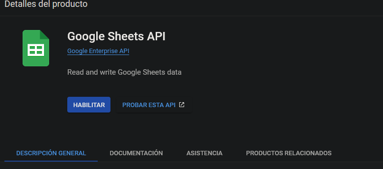
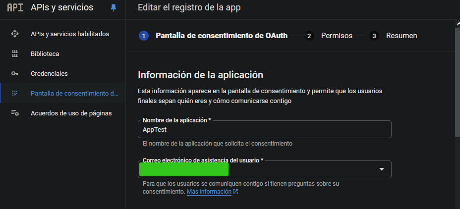
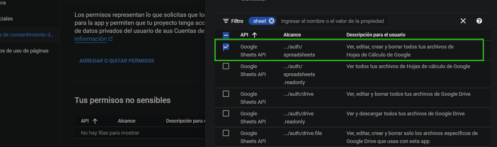
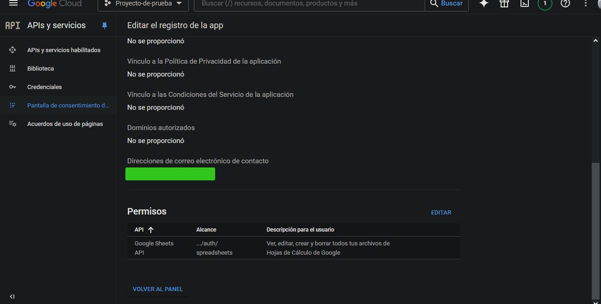

Este script utiliza la API de VMware para extraer datos de las máquinas virtuales conectadas a un vCenter y publica estos datos en una hoja de cálculo de Google Sheets.

## requisitos previos 
- make

``` bash
# instalación de make en Ubuntu/Debian 
sudo apt install make 
```
- docker 
``` bash
# instalación de docker en Ubuntu/Debian 

## agregar las GPG keys oficiales de Docker
sudo apt-get update
sudo apt-get install ca-certificates curl
sudo install -m 0755 -d /etc/apt/keyrings
sudo curl -fsSL https://download.docker.com/linux/debian/gpg -o /etc/apt/keyrings/docker.asc
sudo chmod a+r /etc/apt/keyrings/docker.asc

# agregar los repositorios a APT 
echo \
  "deb [arch=$(dpkg --print-architecture) signed-by=/etc/apt/keyrings/docker.asc] https://download.docker.com/linux/debian \
  $(. /etc/os-release && echo "$VERSION_CODENAME") stable" | \
  sudo tee /etc/apt/sources.list.d/docker.list > /dev/null
sudo apt-get update
```
## Configuración
### Google sheets API

1. Cree un nuevo [proyecto en Google Cloud](https://console.cloud.google.com/projectcreate?hl=es-419). Complete los campos necesarios.

2. Vaya a **APIs y servicios > Biblioteca** y asegúrese de estar en el proyecto creado.


3. Busque y habilite **Google Sheets API**.



4. Vaya a **Pantalla de consentimiento de OAuth**. Seleccione el tipo de usuario **Interno** y complete los campos que sean necesarios.





5. Agregue permisos para el servicio en **AGREGAR O QUITAR PERMISOS**. Seleccione los permisos para acceder a archivos de Google Sheets.






6. Cree una cuenta para el bot con permisos para escribir en Google Sheets: **Credenciales > CREAR CREDENCIALES > ID de cliente de OAuth**. Seleccione **Aplicación web** y guarde.


 7. Descargue el archivo JSON de credenciales y renómbrelo para ubicarlo más facilmente, por ejemplo, `key.json`.


### Autenticación con el archivo JSON y env file 
El programa necesita un archivo `.env` para las credenciales del vCenter y Google Sheets, y el archivo JSON descargado. Ambos deben estar en la raíz del proyecto.

Estructura del Archivo `.env`

``` bash
# .env file 
VCENTER_IP=''             # IP or hostname del vCenter 
VCENTER_USERNAME=''       # Usuario de acceso al vCenter
VCENTER_PASSWORD=''       # Contraseña de acceso al vCenter
GSHEET_NAME=''            # Nombre de la hoja del sheet 
GSHEET_ID=''              # Sheet ID 
GSHEET_KEY_PATH=''        # Ruta del archivo JSON, si esta en la raiz del proyecto solo es necesario especificar el nombre sin ninguna ruta adicional
```

El `GSHEET_ID` puede obtenerse en la URL del sheet sobre el que desea escribir los datos, esta comienza y termina con un `/`.


 ### Use de make 
El repositorio contiene un archivo `Makefile` que automatiza la instalación y el despliegue del programa en un contenedor Docker, así como la configuración de un crontab job en `/etc/crontab`. 

Este se debe usar una vez que tenga ambos archivos `key.json` y `.env` agregados en la raiz del proyecto. 

``` bash
# instalación 
sudo make install 

# para eliminar el programa así como su configuración 
sudo make remove 
```